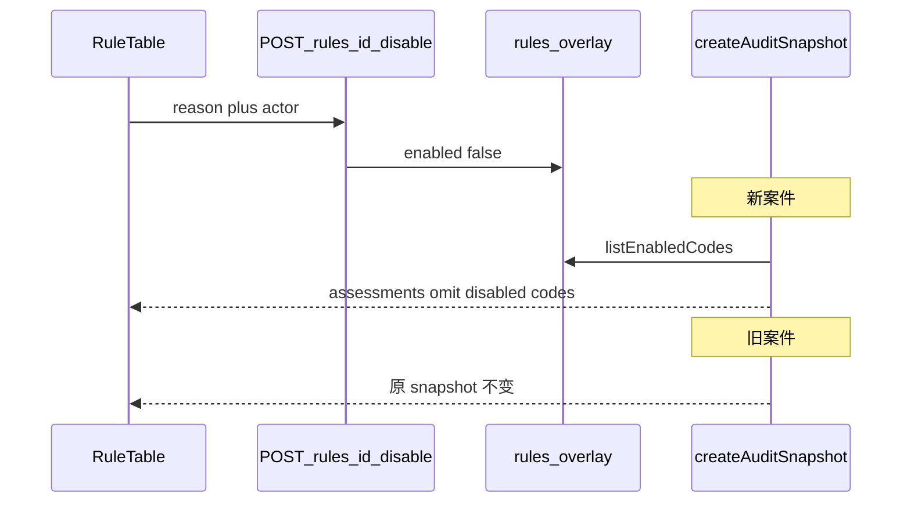

# 合同审计工作台：分波次实现计划

> **For agentic workers:** Wave 1 按 Task 顺序做。每步先写失败测试，再写最小实现。不要跨波次捎带 Wave 2 的 catalog / 发布门禁。

**Goal:** 演示能讲「停用规则 → 新案件不再命中 → 旧案件可复现」，且现场不因复核绑错、队列不刷新、筛选失效翻车。

**Architecture:** 规则逻辑与已发布参数版本不可变（ADR-0003）。`rules.enabled` 是运营 overlay。`createAuditSnapshot` 增加可选 `enabledRuleCodes`：缺省保持「全跑」（现有单测不动）；审计创建路径传入当前启用集合。已有 snapshot 永不回写。

**Tech Stack:** Bun、Elysia、Drizzle、PostgreSQL、React 19、Ant Design 6、TanStack Query/Router、Playwright、`bun:test`。

---

## 已锁定的 Wave 1 语义（拆任务前先钉死）

这些不再讨论，实现时按此写测试：

1. **停用 ≠ 退役。** `retired` 只表示「被更新的发布顶替」，文案改为「已退役」。运行时开关是 `rules.enabled`。
2. **停用后新案件：该规则从 `ruleAssessments` 消失**，不标「不适用」（不适用留给 Wave 2 审查覆盖）。演示对比最干净。
3. **只过滤参数不够。** 引擎在缺参数时会用代码默认值继续跑。必须把 `enabledRuleCodes` 传进 `[packages/audit/src/orchestrator.ts](packages/audit/src/orchestrator.ts)`。
4. `**enabledRuleCodes` 缺省 = 全跑**，golden-eval / 现有 orchestrator 单测零改动。
5. `**SUBJECT_RED_LINE_RISK` 停用时：** dispatcher 跳过主体核验阶段，也不把 `verification.ruleAssessment` 合并进 snapshot。
6. **操作人 Wave 1 仍写死「规则管理员」**（与现有 publish/validate 一致）。统一操作人是 Wave 2。
7. **不删规则、不上登录、不改历史 snapshot、不做 DSL。**
8. **Playwright 停用 `ADVANCE_PAYMENT_LIMIT` 后必须在 `afterEach`/`finally` 重新启用**，避免污染共享开发库。




---

## Wave 1 — 演示冲刺（按 Task 执行）

### Task 1: 引擎允许按 code 跳过规则

**Files:**

- Modify: `[packages/audit/src/orchestrator.ts](packages/audit/src/orchestrator.ts)`（`createAuditSnapshot` input + 组装 `ruleAssessments` 的数组）
- Test: `[packages/audit/src/orchestrator.test.ts](packages/audit/src/orchestrator.test.ts)`

- [ ] **Step 1: 写失败测试**

在 `orchestrator.test.ts` 追加：

```ts
test("omits assessments whose rule codes are not in enabledRuleCodes", () => {
  const snapshot = createAuditSnapshot({
    sourceRecordId: "source-1",
    document: normalizeContractDocument("乙方签订后支付合同金额的70%作为预付款。"),
    policyLimitRatio: 0.3,
    enabledRuleCodes: ["PENALTY_RATIO_LIMIT"],
  });
  expect(snapshot.ruleAssessments.map((a) => a.ruleCode)).toEqual(["PENALTY_RATIO_LIMIT"]);
});

test("runs every deterministic rule when enabledRuleCodes is omitted", () => {
  const snapshot = createAuditSnapshot({
    sourceRecordId: "source-1",
    document: normalizeContractDocument("乙方签订后支付合同金额的70%作为预付款。"),
  });
  expect(snapshot.ruleAssessments.some((a) => a.ruleCode === "ADVANCE_PAYMENT_LIMIT")).toBe(true);
  expect(snapshot.ruleAssessments.length).toBeGreaterThan(10);
});
```

- [ ] **Step 2:** `bun test packages/audit/src/orchestrator.test.ts` — 期望 FAIL（没有 `enabledRuleCodes`）
- [ ] **Step 3:** 给 input 增加 `enabledRuleCodes?: readonly RuleCode[]`。把现有 16 个 `evaluate`* 收成「评估 + code」列表，最后 `.filter` 再 `.map` 钉 `ruleVersion`。事实提取仍全跑（便宜且不改变 Evidence 形状）；只省略 assessment。
- [ ] **Step 4:** 再跑同一文件 — PASS。现有三条测试不能改期望。
- [ ] **Step 5:** 提交 `feat: allow createAuditSnapshot to skip disabled rule codes`

---

### Task 2: Schema 与迁移

**Files:**

- Modify: `[apps/api/src/db/schema.ts](apps/api/src/db/schema.ts)` `rules` 表（约 L218–226）
- Create: `apps/api/drizzle/0008_rule_runtime_enabled.sql`
- Modify: `[apps/api/drizzle/meta/_journal.json](apps/api/drizzle/meta/_journal.json)`（下一条 idx 8）
- 按仓库惯例补 snapshot（与 0007 同流程：`cd apps/api && bunx drizzle-kit generate` 若手写 SQL 则同时改 snapshot，不要只改 journal）

列：

- `enabled boolean not null default true`
- `disabled_reason text`
- `disabled_by text`
- `disabled_at timestamptz`

现有行全部 `enabled = true`。

- [ ] **Step 1:** 改 schema + 写迁移
- [ ] **Step 2:** `cd apps/api && bunx drizzle-kit migrate`
- [ ] **Step 3:** 提交 `feat: add rule runtime enabled overlay columns`

---

### Task 3: 仓库、Fake、HTTP

**Files:**

- Modify: `[apps/api/src/db/rule-repository.ts](apps/api/src/db/rule-repository.ts)`
  - `RuleRecord` / `RuleListItem` 增加 `enabled`、`disabledReason`、`disabledBy`、`disabledAt`
  - `toRule` 映射新列
  - `disableRule(id, { reason, actor })`：`reason.trim()` 为空则 `RuleRepositoryError`；已停用再停用是幂等成功，仍可更新 reason
  - `enableRule(id, { actor })`：清掉 reason/by/at，`enabled=true`
  - `listEnabledCodes()`：`select code where enabled = true`
  - `getPublishedVersions`：现有 `where` 加上 `eq(rules.enabled, true)`（L536）
- Modify: `[apps/api/src/testing/fakes.ts](apps/api/src/testing/fakes.ts)` `InMemoryRuleRepository` 同步上述行为
- Modify: `[apps/api/src/routes/rules.ts](apps/api/src/routes/rules.ts)`

API：

```text
POST /api/rules/:id/disable  { reason: string, actor?: string }
POST /api/rules/:id/enable   { actor?: string }
```

`actor` 缺省 `"规则管理员"`。404 规则不存在；400 停用原因为空。列表/详情 JSON 带上 overlay 字段。

- [ ] **Step 1:** 在 `[apps/api/src/routes/rules.test.ts](apps/api/src/routes/rules.test.ts)` 追加：
  - 创建后 `enabled === true`
  - disable 无 reason → 400
  - disable 后 GET 详情 `enabled === false` 且带 reason
  - `getPublishedVersions([code])` 对已停用规则返回空（通过再发一个创建审计或直接调 repo）
  - enable 后恢复
- [ ] **Step 2:** `bun test apps/api/src/routes/rules.test.ts` — FAIL
- [ ] **Step 3:** 实现 repo + fake + routes
- [ ] **Step 4:** 单测 PASS
- [ ] **Step 5:** 提交 `feat: add rule disable and enable API`

---

### Task 4: 审计创建路径接上 enabled 集合

**Files:**

- Modify: `[apps/api/src/routes/audit-cases.ts](apps/api/src/routes/audit-cases.ts)`
  - `buildRuleInputs` 改为同时 `listEnabledCodes()`
  - 两处 `createAuditSnapshot`（文本 L106、上传 L146）传入 `enabledRuleCodes`
- Modify: `[apps/api/src/dispatcher.ts](apps/api/src/dispatcher.ts)` L79–92
  - 若 `SUBJECT_RED_LINE_RISK` 不在 enabled 集合：跳过 `SUBJECT_VERIFICATION` 阶段（或阶段仍报完成但不调用 port），**不要**把 `verification.ruleAssessment` 推进 `ruleAssessments`
  - enabled 集合必须在创建案件时写入某处，否则 retry 会看到「现在的」开关而不是「当时的」—— Wave 1 接受这个限制（retry 本就不重算规则）。实现上 dispatcher 读 **当前** `listEnabledCodes` 即可，与「retry 不刷新 snapshot」一致：主体评估若已在 snapshot 里就不会重跑规则引擎；retry 重跑 `runAudit` 时 snapshot 已 frozen，只是 subject 会再跑。**更干净的 Wave 1 做法：** subject 是否合并以 **snapshot 里是否已有该 assessment** 为准；新案件创建时 snapshot 不含 subject（本来就是 dispatcher 后挂的）。因此：新案件创建后 dispatcher 读当前 enabled；旧案件 retry 时 snapshot.ruleAssessments 已无该规则，subject 若再合并会「加回」一条——**retry 时也必须看 enabled，否则停用后点重试会把主体规则加回来。** 所以 dispatcher 每次都 `listEnabledCodes()`。
- Test: 优先复用 `[apps/api/src/routes/audit-cases](apps/api/src/routes)` 已有测试文件；若无则在 `apps/api/src/routes/audit-cases.test.ts` 用 Fake repo：先 seed + publish ADVANCE，disable 后 POST 案件，断言 snapshot assessments 不含 `ADVANCE_PAYMENT_LIMIT`。

- [ ] **Step 1:** 写失败测试（disable → 创建案件 → assessments 不含该 code）
- [ ] **Step 2:** 接线
- [ ] **Step 3:** PASS 后提交 `feat: skip disabled rules when assembling new audit snapshots`

---

### Task 5: 规则治理 UI

**Files:**

- Modify: `[apps/web/src/rule-presentation.ts](apps/web/src/rule-presentation.ts)`
  - `retired: "已退役"`
  - 增加 `ruleRuntimeLabels`: `{ enabled: "运行中", disabled: "已停用" }`
  - `filterRules` 增加可选 `runtime: "ALL" | "enabled" | "disabled"`（Wave 1 列表至少要能靠 Switch 看出状态；筛选器可选，有则测）
  - `contractTypeOptions` 改为 `{ value: string; label: string }[]`，第一项 `{ value: "ALL", label: "全部" }`，**不要**再把 `"全部"` 当 value
- Modify: `[apps/web/src/rule-presentation.test.ts](apps/web/src/rule-presentation.test.ts)` L68–73 期望改为「已退役」；补 `contractTypeOptions` 首项 value 为 `ALL` 的测试
- Modify: `[apps/web/src/api.ts](apps/web/src/api.ts)` 增加 `disableRule` / `enableRule`
- Modify: `[apps/web/src/components/rule-table.tsx](apps/web/src/components/rule-table.tsx)`
  - 新列「运行」：`Switch` + Tag
  - 停用：`Modal.confirm`，必填 `Input.TextArea` reason，确认后 `onDisable(id, reason)`
  - 启用：可直接 Switch，或轻确认「重新纳入新审计」
  - 操作列仍保留「打开」
- Modify: `[apps/web/src/routes/rules.tsx](apps/web/src/routes/rules.tsx)` 接 mutation，invalidate `["rules"]`
- Modify: `[apps/web/src/components/rule-editor.tsx](apps/web/src/components/rule-editor.tsx)` 基础信息区顶部同样的 Switch + 停用原因展示
- Modify: `[apps/web/src/routes/rule-detail.tsx](apps/web/src/routes/rule-detail.tsx)` 把 enable/disable 传给 editor
- Modify: `[apps/web/src/components/rule-table.tsx](apps/web/src/components/rule-table.tsx)` 合同类型 Select 使用 `option.value`

注意：Ant Design Switch 在表格里不要和行点击抢事件（`onClick={e => e.stopPropagation()}`）。

- [ ] **Step 1:** presentation 单测先改红再改绿
- [ ] **Step 2:** UI + api
- [ ] **Step 3:** 提交 `feat: add rule runtime toggle and fix contract-type filter`

---

### Task 6: 现场会翻车的 bug

互不依赖，可同一提交。

**6a. 复核绑定选中发现**

- Modify: `[apps/web/src/routes/audit-case-detail.tsx](apps/web/src/routes/audit-case-detail.tsx)` L153–157
- `onOpenReview` 改为使用 workbench 当前选中的 finding；若该条已复核则取「当前选中」，不要 `findings.find(review === null)`
- workbench 需把 `selectedFinding` 回传（给 `onOpenReview(decision, finding)` 加第二参，或把 selected 提升到 detail）

推荐：`onOpenReview: (decision, finding) => void`，`[InspectorPanel](apps/web/src/components/audit-case-workbench.tsx)` 已有 `finding`。

**6b. 队列轮询**

- Modify: `[apps/web/src/routes/audit-cases.tsx](apps/web/src/routes/audit-cases.tsx)` L25
- 抄 `[audit-runs.tsx](apps/web/src/routes/audit-runs.tsx)` L38–47：存在 `PENDING`/`RUNNING`（或你们的 processing 枚举）时 `refetchInterval: 2000`，否则 `false`

**6c. 侧栏**

- Modify: `[apps/web/src/components/app-shell.tsx](apps/web/src/components/app-shell.tsx)`
  - 删掉「用户与权限」disabled 项（L139–147 整组「系统管理」若只剩这一项则整组删除）
  - 桌面 `selectedKeys` 传入 `origin`（约 L271），与移动端 L364 对齐

**6d. 轨迹默认展开**

- Modify: `[apps/web/src/app.tsx](apps/web/src/app.tsx)` `traceRoute.validateSearch` 增加 `expand?: boolean`（`search.expand === "1" | true`）
- Modify: `[apps/web/src/components/agent-trace-timeline.tsx](apps/web/src/components/agent-trace-timeline.tsx)` 增加 `defaultExpanded?: boolean`，true 时初始 `expanded = all collapsibleKeys`
- 工作台「打开轨迹」带 `search: { expand: true }`（`[audit-case-detail.tsx](apps/web/src/routes/audit-case-detail.tsx)` L165–169）

- [ ] 提交 `fix: bind review to selected finding and unblock demo live path`

---

### Task 7: `/demo` 接真实数据

**Files:**

- Modify: `[apps/web/src/routes/demo.tsx](apps/web/src/routes/demo.tsx)`
  - 用 `useQuery(["rules"], listRules)` + 已有 validation API（或只展示 `rules.length`、`enabled` 数、每条 `lastValidation`）
  - 删掉写死的 4 条规则矩阵，改为 Table/Listy 渲染真实规则（最多 8 行 + 「查看全部」Link）
  - CTA 全部改为 TanStack `Link`：`/audit-cases`、`/rules`、`/audit-cases/$id/trace`
  - 「开始演示」→ `/audit-cases?new=1` 或保持打开新建抽屉的 search（若还没有 `new` search，Wave 1 只 Link 到队列即可，避免扩 scope）
- 视觉：去掉自绘 hex，改用页面已有 Card/Statistic，与工作台同一套 token（`[theme.ts](apps/web/src/theme.ts)`）

- [ ] 提交 `feat: drive demo page from live rules`

---

### Task 8: Playwright + 全量闸门

**Files:**

- Modify: `[tests/acceptance/rules.spec.ts](tests/acceptance/rules.spec.ts)`
  - 新用例：打开 ADVANCE 行 → 停用（填原因「演示关闭预付款规则」）→ 列表显示已停用
  - 新建审计，使用会触发 70% 预付款的 demo 合同
  - 工作台等待完成后：**不应**出现预付款超限发现
  - `finally`：再 POST enable（用 `page.request` 调 API，比 UI 更稳）
- Modify: `[tests/acceptance/audit-case.spec.ts](tests/acceptance/audit-case.spec.ts)`（或新建短 spec）
  - 多发现时选第二条再确认风险，断言复核的是第二条（若现有用例已单发现，就造/选一个多 finding 的 demo）

- [ ] `bun run verify`
- [ ] `bunx playwright test tests/acceptance/rules.spec.ts tests/acceptance/audit-case.spec.ts`
- [ ] 提交 `test: cover rule disable in new audits and selected-finding review`

**Wave 1 演示脚本（验收人用手点）：**

1. `/demo` 看到真实规则数
2. `/rules` 停用「预付款上限」，填原因
3. 新建内置 demo 合同 → 工作台无预付款发现
4. 打开此前已完成的旧案件 → 预付款发现仍在
5. 打开轨迹（应已展开）
6. 多发现时点第二条确认风险
7. 队列里再丢一个案件，无需手动刷新能看到处理中

---

## Wave 2 — 产品诚实性（与 Wave 1 同级的 TDD 任务）

> 等 Wave 1 全绿后再开。不要在 Wave 1 的 PR 里捎带这些。

已锁定：

1. **不给 `SUBJECT_RED_LINE_RISK` 编合同 golden。** seed 已写明主体由外部核验决定（`[seed-validation-cases.ts](apps/api/src/db/seed-validation-cases.ts)` L20–23）。发布门禁对它单独放行 `total === 0`。
2. **未知 code 不能入库。** 引擎目录 = `[RuleCode](packages/audit/src/model.ts)` L5–22 共 17 个（含主体）。
3. **Finding 没有 `ruleCode` 字段**（`[FindingProposal](packages/audit/src/model.ts)` L200–206）。Inspector 用 `findingType` 对齐 `ruleCode`（见 `[proposal-guard.ts](packages/audit/src/proposal-guard.ts)`）。
4. **「不适用」= 引擎目录 − 本案件 `ruleAssessments`**（Wave 1 停用后消失的规则落在这里）。不新增 disposition。

---

### Task 9: 引擎目录 + 拒绝幽灵规则

**Files:**

- Create: `[packages/audit/src/rule-catalog.ts](packages/audit/src/rule-catalog.ts)`
- Modify: `[packages/audit/src/index.ts](packages/audit/src/index.ts)` 导出
- Modify: `[apps/api/src/routes/rules.ts](apps/api/src/routes/rules.ts)` `POST /api/rules`
- Modify: `[apps/web/src/routes/rules.tsx](apps/web/src/routes/rules.tsx)`
- Test: `packages/audit/src/rule-catalog.test.ts`、`[apps/api/src/routes/rules.test.ts](apps/api/src/routes/rules.test.ts)`

```ts
export const ENGINE_RULE_CODES = [ /* 与 RuleCode union 顺序一致 */ ] as const satisfies readonly RuleCode[];

export function isEngineRuleCode(code: string): code is RuleCode {
  return (ENGINE_RULE_CODES as readonly string[]).includes(code);
}

export const RULE_CATALOG_IS_COMPLETE: Exclude<
  RuleCode,
  (typeof ENGINE_RULE_CODES)[number]
> extends never ? true : never = true;
```

- [ ] **Step 1:** catalog 单测：17 个 code、`isEngineRuleCode("PLAYWRIGHT_RULE_X") === false`
- [ ] **Step 2:** `bun test packages/audit/src/rule-catalog.test.ts` — FAIL
- [ ] **Step 3:** 实现 catalog + 导出
- [ ] **Step 4:** `!isEngineRuleCode(body.code)` → 400「规则代码不在引擎目录中」
- [ ] **Step 5:** `rules.test.ts`：POST `GHOST_RULE` 期望 400。**先改** `[tests/acceptance/rules.spec.ts](tests/acceptance/rules.spec.ts)`：不再 POST `PLAYWRIGHT_RULE_%`，改为打开已有 ADVANCE 或对未占用的引擎 code 建规
- [ ] **Step 6:** 创建弹窗 code 改为 Select；已在 `listRules` 中的 code `disabled`
- [ ] **Step 7:** 相关单测 PASS
- [ ] **Step 8:** 提交 `feat: reject rule codes outside the engine catalog`

---

### Task 10: 发布门禁要求有 golden 用例

**Files:**

- Modify: `[apps/api/src/db/rule-repository.ts](apps/api/src/db/rule-repository.ts)` `publish` L492–495
- Modify: `[apps/web/src/rule-presentation.ts](apps/web/src/rule-presentation.ts)` `describePublishGate`
- Modify: `[apps/web/src/rule-presentation.test.ts](apps/web/src/rule-presentation.test.ts)`
- Modify: `[apps/api/src/routes/rules.test.ts](apps/api/src/routes/rules.test.ts)`

`runGoldenValidation` 无 label 仍返回 `total: 0, failed: 0`。**只改门禁，不改 bench。**

```ts
export const PUBLISH_WITHOUT_CONTRACT_GOLDEN: readonly RuleCode[] = ["SUBJECT_RED_LINE_RISK"];
```

`publish` 在 `run.status === "passed"` 之后：`total === 0` 且 code 不在例外 → 409「没有可验证的案例，不能发布」。

`describePublishGate` 增加 `ruleCode` 参数，同样判断。

- [ ] **Step 1:** presentation 单测：普通规则 `total: 0` → gate 关；主体规则 `total: 0` → gate 开
- [ ] **Step 2:** HTTP/repo 单测：空 golden 的 passed run publish → 409
- [ ] **Step 3:** 实现
- [ ] **Step 4:** 提交 `fix: refuse to publish rules with an empty golden set`

---

### Task 11: 工作台 Tab / 证据 / 事实 / 覆盖 / 主体按钮

测试以 presentation 纯函数为主。

**Files:**

- Modify: `[apps/web/src/audit-presentation.ts](apps/web/src/audit-presentation.ts)`
- Modify: `[apps/web/src/components/audit-case-workbench.tsx](apps/web/src/components/audit-case-workbench.tsx)`
- Test: 新建或扩展 `apps/web/src/audit-presentation.test.ts`

**11a. 待处理 / 全部**

```ts
export function visibleFindings(
  findings: FindingRevision[],
  tab: "pending" | "all",
): FindingRevision[]
```

- L675–679 改成可点 tab
- `selectedFindingIndex` 始终是**全量** findings 下标；点击用 `findIndex` by id
- 切到待处理时若当前已复核，落到第一条未复核

**11b. 证据点击定位**

- 增加 `focusedBlockId`；`DOCUMENT_SPAN` 的 `.source-item` 改为 button
- 现有 `useEffect` 同时听 `focusedBlockId` 滚到 `[data-block-id]`
- 外验证据不滚动

**11c. 事实网格按发现类型**

```ts
export function factCellsForFinding(findingType: FindingType, facts: PaymentFacts): FactCells | null
```

先核对真实 `FindingType`。仅预付款类画三格，其余 `null` 不渲染 `.facts-grid`。

`assessmentsForFinding`：优先 `ruleCode === findingType`，对不上则退回全部 `POLICY_CONFLICT`。

**11d. 审查覆盖**

- 覆盖条可点，Drawer/Collapse 四组：通过 / 违反 / 证据不足 / 不适用
- 不适用 = `ENGINE_RULE_CODES` 中没有对应 assessment 的 code

**11e. 隐藏确认主体**

- 删除「确认主体」按钮和 `confirmSubject`
- Radio 改只读列表；文案写明本版不写入核验结果

- [ ] **Step 1:** 纯函数单测
- [ ] **Step 2:** 改 UI
- [ ] **Step 3:** 提交 `feat: make review workbench tabs evidence and coverage operable`

---

### Task 12: 操作人、文档、驾驶舱

**12a. 操作人**

- Create: `[apps/web/src/operator.ts](apps/web/src/operator.ts)` — 从 `[review-center.tsx](apps/web/src/components/review-center.tsx)` L41–70 抽出 `readOperator` / `writeOperator`
- rule-detail、validation、Wave 1 的 disable/enable 全部改 `readOperator()`
- 侧栏假角色改为显示 `readOperator()`。不做登录页。

**12b. 驾驶舱**

- `[dashboard.tsx](apps/web/src/routes/dashboard.tsx)` L108–115：Result + 重试 refetch
- 待办 Link 带 `origin: "reviews"`，另加「去复核中心」→ `/reviews`

**12c. 文档**

- `[README.md](README.md)` L15：去掉「不含 PDF」；写明 txt/docx/pdf + 参数版本 + 运行时启停
- `[docs/architecture/mvp.md](docs/architecture/mvp.md)` 补规则/复核/整改/enable API
- `[docs/design/ui-design-spec.md](docs/design/ui-design-spec.md)` §5.1：版本状态 ≠ 运行开关；`retired` = 已退役

- [ ] 提交 `refactor: share operator identity and align docs with shipped capabilities`

**Wave 2 Playwright：** 创建规则无自由输入；工作台「待处理」可点；点证据后对应 `data-block-id` 进入视口。

---

## Wave 3 — 可审计与可观测（与 Wave 1/2 同级的 TDD 任务）

> Wave 1+2 全绿后再开。迁移号：Wave 1 = `0008`，本波操作日志 = `0009`。

已锁定：

1. **`rules.completed` 事件已存在**（[`ports.ts`](packages/audit/src/ports.ts) L79，dispatcher L69）但无 payload。扩展它，不另造事件名。
2. **规则评估在 POST 创建案件时已经写进 snapshot**，RUNNING 态 GET 就能读到。运行中预览主要是前端把工作台从「只显示 Steps」改为「显示已有 assessments」。
3. **`claimCase` / `getSnapshotByCase` 都是 `LIMIT 1` 且无 `ORDER BY`**（[`repositories.ts`](apps/api/src/db/repositories.ts) L372–377、L846–851）。现在 1 案 1 快照所以没爆；reassess 追加快照后必须改成 `ORDER BY created_at DESC`。
4. **reassess 只允许** `FAILED | INTERRUPTED | CANCELLED`（与现有「重试」按钮同一批终态）。COMPLETED 有整改链，本波不重评，避免和 finding 链打架。
5. **旧 snapshot / 旧 finding 不删。** 新快照 append；UI 读最新快照。finding 仍属案件，重评后新 Agent Run 再提案。
6. **不上 pino / OTel**（留给 Wave 4）。本波只把 trace 空 `catch` 改成 `console.warn`。

---

### Task 13: `ruleVersionId` + 写入 `snapshot.policy`

**Files:**
- Modify: [`packages/audit/src/model.ts`](packages/audit/src/model.ts) `RuleAssessment` 增加 `ruleVersionId?: string | null`
- Modify: [`packages/audit/src/orchestrator.ts`](packages/audit/src/orchestrator.ts) input 增加 `ruleVersionIds?: Partial<Record<RuleCode, string>>`，组装时与 `ruleVersion` 一起钉上
- Modify: [`apps/api/src/routes/audit-cases.ts`](apps/api/src/routes/audit-cases.ts) `buildRuleInputs`：`getPublishedVersions` 已返回 `versionId`，一并传出
- Modify: [`apps/api/src/db/repositories.ts`](apps/api/src/db/repositories.ts) L337 `policy: null` → 写入 policy 对象
- Test: [`packages/audit/src/orchestrator.test.ts`](packages/audit/src/orchestrator.test.ts)、审计创建测试

```ts
export interface AuditSnapshotPolicy {
  enabledRuleCodes: RuleCode[];
  ruleVersionIds: Partial<Record<RuleCode, string>>;
  policyLimitRatio?: number;
}
```

`audit_snapshots.policy` 已是 jsonb，**不必新列**。历史行保持 `null`，UI 按缺失处理。

- [ ] **Step 1:** orchestrator 单测：传入 `ruleVersionIds: { ADVANCE_PAYMENT_LIMIT: "uuid" }` → 对应 assessment 带上该 id
- [ ] **Step 2:** FAIL 后实现映射
- [ ] **Step 3:** 创建案件的集成测试：GET 详情 `snapshot.policy.enabledRuleCodes` 为数组，且含已启用 code
- [ ] **Step 4:** 提交 `feat: pin ruleVersionId and enabled codes on audit snapshots`

---

### Task 14: 列表「最近验证」优先当前草稿

**Files:**
- Modify: [`apps/api/src/db/rule-repository.ts`](apps/api/src/db/rule-repository.ts) L249–261
- Modify: fake [`apps/api/src/testing/fakes.ts`](apps/api/src/testing/fakes.ts) 同样语义
- Test: `apps/api/src/db/rule-repository` 已有测或 `rules.test.ts`

算法：`const draft = versions.find(v => v.status === "draft")`；若 draft 有 `lastValidationRunId` 用它；否则用 published 的；再否则才扫其余版本。

- [ ] **Step 1:** 单测：草稿无 run、v1 published 有 run → 列表显示 published 的 run；草稿也有 run → 显示草稿的
- [ ] **Step 2:** 实现
- [ ] **Step 3:** 提交 `fix: prefer draft validation run on the rule list`

---

### Task 15: 操作审计日志

**Files:**
- Modify: [`apps/api/src/db/schema.ts`](apps/api/src/db/schema.ts) 新表
- Create: `apps/api/drizzle/0009_audit_action_logs.sql` + journal idx 9
- Modify: rule-repository disable/enable/publish、findings review、remediation close 各写一行
- Modify: [`apps/api/src/routes/rules.ts`](apps/api/src/routes/rules.ts) `GET /api/rules/:id/actions`
- Modify: [`apps/web/src/components/rule-editor.tsx`](apps/web/src/components/rule-editor.tsx) 发布记录旁增加「操作记录」只读表（最近 20）

```sql
create table audit_action_logs (
  id uuid primary key default gen_random_uuid(),
  actor text not null,
  action text not null, -- rule.disable | rule.enable | rule.publish | finding.review | remediation.close
  target_type text not null,
  target_id uuid not null,
  reason text,
  created_at timestamptz not null default now()
);
```

不单开页面。失败写日志不得导致主操作 500（与 trace 同原则，但这里是同步 insert，失败应 warn + 继续）。

- [ ] **Step 1:** 迁移 + schema
- [ ] **Step 2:** disable 单测：操作后 GET actions 含 `rule.disable` 和 reason
- [ ] **Step 3:** 接线 publish/review
- [ ] **Step 4:** 规则详情只读表
- [ ] **Step 5:** 提交 `feat: record operator actions for rule and review mutations`

---

### Task 16: 按当前规则重评（与重试智能体拆开）

**Files:**
- Modify: [`apps/api/src/db/repositories.ts`](apps/api/src/db/repositories.ts)
  - `claimCase` / `getSnapshotByCase`：`ORDER BY s.created_at DESC`
  - 新增 `appendSnapshot(caseId, snapshot)`
- Modify: [`apps/api/src/routes/audit-cases.ts`](apps/api/src/routes/audit-cases.ts)
  - `POST /api/audit-cases/:id/reassess` → 202
- Modify: dispatcher 或 route：读 `source_records.sourceText` → `normalizeContractDocument` → `buildRuleInputs` + `createAuditSnapshot` → `appendSnapshot` → `retry`（置 PENDING + enqueue）
- 状态守卫：仅 `FAILED | INTERRUPTED | CANCELLED`，否则 409
- Modify: workbench 失败态：主按钮「按当前规则重评」，下拉「仅重试智能体」（现有 retry）
- Test: `apps/api/src/routes/audit-cases` / dispatcher 测试

重建输入必须走**当前** `listEnabledCodes` + published 参数，这才是「停用后再重评，预付款消失」的第二条演示线。

- [ ] **Step 1:** 单测 claimCase 在两份 snapshot 时返回较新的
- [ ] **Step 2:** 单测：disable ADVANCE → reassess 失败案件 → 新 snapshot 不含该 assessment
- [ ] **Step 3:** COMPLETED 调 reassess → 409
- [ ] **Step 4:** UI 拆两个动作
- [ ] **Step 5:** 提交 `feat: reassess audit cases against current published rules`

---

### Task 17: 运行中可见规则覆盖

**Files:**
- Modify: [`packages/audit/src/ports.ts`](packages/audit/src/ports.ts)

```ts
| {
    type: "rules.completed";
    auditCaseId: string;
    summary?: { total: number; conflict: number; needsReview: number; compliant: number };
  }
```

`summary` 可选，避免弄坏现有 dispatcher 测试字面量（[`dispatcher.test.ts`](apps/api/src/dispatcher.test.ts) L112 只断言 type）。
- Modify: [`apps/api/src/dispatcher.ts`](apps/api/src/dispatcher.ts) L69：带上 snapshot 的 coverage 摘要
- Modify: [`apps/web/src/components/audit-case-workbench.tsx`](apps/web/src/components/audit-case-workbench.tsx) L620–641：`running` 时在 Alert 下方渲染覆盖摘要（复用 Wave 2 的 coverage 组件，只读）
- SSE：`rules.completed` 已会触发详情 refetch（确认 [`audit-case-detail.tsx`](apps/web/src/routes/audit-case-detail.tsx) 的 `useAuditEvents`；若只忽略 `agent.trace`，这条会 refetch——保持如此）

- [ ] **Step 1:** dispatcher 测试：`rules.completed` 带 `summary.total > 0`
- [ ] **Step 2:** 实现 payload + 工作台预览
- [ ] **Step 3:** 提交 `feat: show rule coverage while an audit is running`

---

### Task 18: trace 写入失败可见

**Files:**
- Modify: [`packages/audit/src/agent-trace.ts`](packages/audit/src/agent-trace.ts) L37
- Test: [`packages/audit/src/agent-trace.test.ts`](packages/audit/src/agent-trace.test.ts)

```ts
tail = tail.then(() => write(step)).catch((error) => {
  console.warn("agent_trace_write_failed", { runId, sequence: step.sequence, error });
});
```

审计仍不因 trace 失败而失败。单测用 fake console.warn。

- [ ] **Step 1:** 单测 write reject 时 warn 被调用、sink 不抛
- [ ] **Step 2:** 实现
- [ ] **Step 3:** 提交 `fix: warn when agent trace persistence fails`

---

## Wave 4 — 平台能力（有数据才进导航）

> 赛后 / 有余力。规格 §5.3–5.8 里的空壳**继续禁止**。每条任务要么读已有表/配置，要么先把数据写进去再露面。

已锁定：

1. **不做 MinIO / SSO / OpenTelemetry / 完整法规树。** 用本地目录、`X-Operator`、现有 health、制度条款只读摘录替代。
2. **`/regulations`、`/plugins` 本波不建路由。** 没有条款库和插件注册表，做了就是假导航。
3. **核验页、集成页**可以进侧栏「能力与集成」，因为 `subject_verifications` 和 `/api/health` 已有数据。
4. 迁移号：Wave 1=`0008`，Wave 3=`0009`，本波原始文件若加列则 `0010`。

---

### Task 19: 上传大小与 MIME 门禁

**Files:**
- Modify: [`apps/api/src/config.ts`](apps/api/src/config.ts) `maxUploadBytes`（默认 10_485_760）
- Modify: [`apps/api/src/routes/audit-cases.ts`](apps/api/src/routes/audit-cases.ts) L127–173
- Modify: [`apps/api/src/document/index.ts`](apps/api/src/document/index.ts) 增加 MIME 白名单校验（`application/pdf`、docx OOXML、`text/plain`）；扩展名与 MIME 不一致 → 422
- Test: 新建 `apps/api/src/routes/audit-cases-upload.test.ts` 或扩现有 upload 测试
- Modify: [`apps/web/src/components/new-audit-drawer.tsx`](apps/web/src/components/new-audit-drawer.tsx) `beforeUpload` 同步拦截，避免大文件打到 API

- [ ] **Step 1:** 单测：11MB buffer → 413；`file.jpg` 改后缀 `.pdf` 但 MIME 是 image → 422
- [ ] **Step 2:** 实现
- [ ] **Step 3:** 提交 `fix: reject oversized or mismatched contract uploads`

---

### Task 20: 共用一个 postgres 连接池

**Files:**
- Modify: [`apps/api/src/app.ts`](apps/api/src/app.ts) L114–115
- Modify: [`apps/api/src/db/repositories.ts`](apps/api/src/db/repositories.ts) `createRepository`
- Modify: [`apps/api/src/db/rule-repository.ts`](apps/api/src/db/rule-repository.ts) L727–729 `createRuleRepository`

改为 `createDb(url) => { db, client }`，两仓库注入同一 `db`。测试用现有 fakes，不必连真库。

- [ ] **Step 1:** 启动装配单测或 smoke：两个 factory 接受同一 db
- [ ] **Step 2:** 实现
- [ ] **Step 3:** 提交 `refactor: share one postgres pool across repositories`

---

### Task 21: `/verification` 核验时间线

数据已在 [`subject_verifications`](apps/api/src/db/schema.ts) L100–111。这是 Source Record，不是结论（规格 §5.5）。

**Files:**
- Modify: repositories 增加 `listSubjectVerifications({ limit })`
- Create: `apps/api/src/routes/verifications.ts` `GET /api/verifications`
- Modify: [`apps/web/src/app.tsx`](apps/web/src/app.tsx) 路由 `/verification`
- Create: `apps/web/src/routes/verification.tsx` 表格：主体名、状态、提供方、采集时间、过期、链到案件
- Modify: [`apps/web/src/components/app-shell.tsx`](apps/web/src/components/app-shell.tsx) 仅当路由注册后出现「外部核验」

- [ ] **Step 1:** API 单测：dispatcher 跑过主体核验后，列表能看到该 party
- [ ] **Step 2:** 页面 + 导航
- [ ] **Step 3:** Playwright：有核验记录的案件跑完后 `/verification` 非空
- [ ] **Step 4:** 提交 `feat: add subject-verification timeline page`

---

### Task 22: `/integrations` 健康页

扩展现有 [`GET /api/health`](apps/api/src/app.ts) L88，**不回显密钥**。

```ts
{
  status: "ok" | "unavailable",
  database: boolean,
  dispatcher: boolean,
  agentMode: "pi" | "fake",
  qccConfigured: boolean,   // Boolean(QCC_TOKEN) 之类，不是 token 本身
  llmConfigured: boolean
}
```

- Create: `apps/web/src/routes/integrations.tsx`：四张卡（PostgreSQL / Dispatcher / 企查查 / 模型），只显示已配置/未配置/延迟
- 顶栏已有 health 轮询，本页复用同一 query
- Test: [`apps/api/src/health.test.ts`](apps/api/src/health.test.ts) 断言响应不含 `apiKey`/`token`

- [ ] **Step 1:** health 单测扩字段且 snapshot 不含秘密
- [ ] **Step 2:** 页面 + 导航
- [ ] **Step 3:** 提交 `feat: show integration health without leaking credentials`

---

### Task 23: dispatcher 以 DB claim 为准

现状：内存 `queue[]` + `claimCase` 的 `SKIP LOCKED`（[`dispatcher.ts`](apps/api/src/dispatcher.ts) L19–41）。多 API 副本会各持一份内存队列并重复 enqueue。

目标：`enqueue` 只把案件置 `PENDING`；`processQueue` 循环 `claimNextPendingCase()`（已有，当前几乎只给测试用），不再 `this.queue.push`。`start()` 不必把 pending id 灌进内存。

**Files:**
- Modify: [`apps/api/src/dispatcher.ts`](apps/api/src/dispatcher.ts)
- Modify: [`apps/api/src/dispatcher.test.ts`](apps/api/src/dispatcher.test.ts)
- `claimNextPendingCase` 必须 `ORDER BY created_at` + `FOR UPDATE SKIP LOCKED`（核对现实现）

- [ ] **Step 1:** 单测：enqueue 后不依赖内部 queue 长度，只依赖 claim 返回
- [ ] **Step 2:** 两份 dispatcher 共用一个 fake repo 时，同一案件只 `runAudit` 一次
- [ ] **Step 3:** 实现
- [ ] **Step 4:** 提交 `fix: claim pending audits from the database not an in-memory queue`

---

### Task 24: 原始上传文件落盘（本地，不是 MinIO）

**Files:**
- Modify: schema `source_records` 增加 `original_path text`（迁移 `0010`）或写到 `metadata.originalPath`
- Create: `apps/api/src/document/original-store.ts`：`UPLOAD_DIR`（默认 `var/uploads`）写入 `{sourceRecordId}{ext}`
- Modify: upload 路由：解析成功后存盘；文本粘贴不写文件
- `GET /api/source-records/:id/original`：仅 FILE_UPLOAD，`Content-Disposition` 附件。无鉴权则至少校验 id 存在（Wave 4 仍是单用户）

- [ ] **Step 1:** 单测：upload 后磁盘有文件，GET 能下回
- [ ] **Step 2:** 案件详情「下载原文」仅 FILE_UPLOAD 显示
- [ ] **Step 3:** 提交 `feat: persist uploaded contract bytes on disk`

不做 S3/MinIO 适配器。需要对象存储时另开波次。

---

### Task 25: `X-Operator` 请求头（不是 SSO）

把 Wave 2 的 `readOperator()` 放到所有写操作 header，后端不再信 body 里的 `publishedBy` / `triggeredBy` / `actor`（兼容：header 优先，缺省才读 body，便于旧测试）。

**Files:**
- Modify: API 写路径（rules disable/publish/validate、findings review、reassess）
- Modify: [`apps/web/src/api.ts`](apps/web/src/api.ts) Eden/fetch 默认头
- 不做登录页、不做角色矩阵。侧栏继续显示 `readOperator()`

- [ ] **Step 1:** 单测：header `张三` + body `李四` → 日志/publishedBy 为张三
- [ ] **Step 2:** 前端接线
- [ ] **Step 3:** 提交 `feat: prefer X-Operator over client-supplied actor names`

---

### Task 26: 明确不做（本波写进计划以免被「顺便做了」）

| 规格页 | 为什么现在不做 |
|---|---|
| `/regulations` | 没有法规树数据；制度上限现在是 snapshot 里的假区块 `policy-limit` |
| `/plugins` | 没有插件注册表；启停已在规则 overlay |
| `/settings/users` | 没有账号表；Wave 1 已删 disabled 菜单 |
| SSO / OIDC | 超出单用户 MVP |
| OpenTelemetry | README 已排除；业务可观测靠 trace + 操作日志 |
| MinIO | Task 24 本地目录已够演示「原文可下载」 |

若一定要「制度可点」，只允许在规则详情的立场区加「制度来源」纯文本 URL，不新开路由。

---

## 刻意不做（全程）

- 动态 DSL
- 物理删除规则
- 回写历史 snapshot
- 用 `retired` 冒充停用
- 只改 UI Switch、后端照跑（产品不诚实）

---

## 风险与回滚

- **共享库 Playwright：** 必须 `finally` enable，否则本地/CI 后续用例找不到预付款发现。
- **Fact 仍全提取：** 停用预付款后 snapshot.facts 里可能还有 ratio；Inspector 不要因为有 fact 就假装规则跑过。
- **Fake vs Pi：** acceptance 走 fake/demo-agent；启停断言只看 snapshot/finding，不依赖模型文案。
- **Wave 4 导航：** `/verification`、`/integrations` 必须在 API 就绪后才注册；不要先挂 disabled 菜单。
- **多副本 dispatcher：** Task 23 完成前不要水平扩 API。

